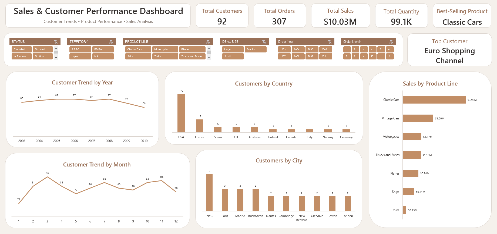

# Sales & Customer Performance Dashboard | Excel Analytics

<p align="center">
  <strong>Interactive Sales & Customer Analytics Dashboard built in Microsoft Excel</strong>
</p>

<p align="center">
  
  
  
  
</p>

---

## 📊 Dashboard

<p align="center">
  
</p>

<p align="center">
  <strong>Sales & Customer Performance</strong> — Customer trends, geographic distribution, product line sales, and interactive business filtering
</p>

---

## 📌 Project Overview

**Sales & Customer Performance Dashboard** is an interactive Microsoft Excel analytics project designed to analyze customer activity, sales performance, order volume, product line performance, and customer distribution across different geographic locations.

The project uses **Power Query, PivotTables, Excel charts, KPI cards, and slicers** to transform structured business data into an interactive analytical dashboard.

The dashboard brings multiple analytical perspectives together in a single reporting environment, allowing users to explore customer and sales performance across time, geography, product lines, and order characteristics.

---

## 🎯 Business Objectives

The dashboard was designed to explore key business questions such as:

- How does customer activity change over the years?
- How does customer activity change across months?
- Which countries have the highest number of customers?
- Which cities have the highest number of customers?
- Which product lines generate the highest sales?
- Which customer is highlighted as the top customer?
- How do sales and customer activity change based on order status?
- How do different territories and deal sizes affect the analysis?
- How does performance change across different order years and months?

---

## 🗂️ Dataset

The dashboard uses structured sales and customer data containing information across several business dimensions.

The analysis focuses on:

| Area | Analysis |
|---|---|
| **Customers** | Total customers and customer distribution |
| **Orders** | Total orders and order activity |
| **Sales** | Total sales performance |
| **Quantity** | Total quantity |
| **Products** | Product line performance |
| **Geography** | Country and city analysis |
| **Time** | Order year and order month |
| **Order Characteristics** | Status, territory, and deal size |

The data is analyzed in Excel and structured to support PivotTables, interactive filtering, KPI calculations, and dashboard visualizations.

---

## 🛠️ Tools & Techniques

| Tool / Technique | Application |
|---|---|
| **Microsoft Excel 365** | Dashboard development and analysis |
| **Power Query** | Data preparation and transformation |
| **PivotTables** | Business metric aggregation and analysis |
| **Excel Charts** | Data visualization |
| **Slicers** | Interactive dashboard filtering |
| **KPI Cards** | High-level performance monitoring |
| **Dashboard Design** | Business-focused visual storytelling |

---

## 🔄 Analytical Workflow

The project follows a structured analytics workflow:

**Raw Data → Data Preparation → PivotTables → Analysis → KPIs → Visualization → Interactive Dashboard**

### Data Preparation

**Power Query** was used for data preparation and transformation before the analytical stage.

The data supports analysis across:

- Customers
- Orders
- Sales
- Quantity
- Products
- Geography
- Time
- Order characteristics

### Data Analysis

**PivotTables** were used to aggregate and analyze the data across different business dimensions.

### Visualization

Excel charts were used to communicate:

- Customer trends
- Geographic customer distribution
- Product line sales performance

### Dashboard Development

The final dashboard combines:

- KPI Cards
- Interactive Slicers
- Customer Trend Charts
- Geographic Analysis
- Product Line Sales Analysis
- Top Customer Highlight
- Consistent Visual Styling

---

# 📈 Dashboard Analysis

The dashboard provides a combined view of **sales performance and customer activity**.

---

## 1. KPI Summary

The dashboard displays five high-level performance indicators:

| KPI | Dashboard Value |
|---|---:|
| **Total Customers** | **92** |
| **Total Orders** | **307** |
| **Total Sales** | **$10.03M** |
| **Total Quantity** | **99.1K** |
| **Best-Selling Product** | **Classic Cars** |

These KPIs provide a high-level view of the current dashboard results and respond to the active dashboard filters.

---

## 2. Top Customer

The dashboard highlights:

**Euro Shopping Channel**

This provides a direct view of the customer identified as the top customer in the dashboard.

---

## 3. Customer Trend by Year

The **Customer Trend by Year** chart tracks customer activity across the years displayed in the dashboard.

The analysis covers:

- 2003
- 2004
- 2005
- 2006
- 2007
- 2008
- 2009
- 2010

The visualization provides a year-by-year view of customer activity and allows changes over time to be compared.

---

## 4. Customer Trend by Month

The **Customer Trend by Month** chart displays customer activity across the twelve months of the year.

The analysis covers:

- January
- February
- March
- April
- May
- June
- July
- August
- September
- October
- November
- December

The monthly trend provides a view of customer activity throughout the year.

---

## 5. Customers by Country

The **Customers by Country** chart displays customer distribution across the countries represented in the dashboard.

The displayed countries include:

- USA
- France
- Spain
- UK
- Australia
- Finland
- Canada
- Italy
- Norway
- Germany

The visualization provides a geographic perspective on the customer base.

---

## 6. Customers by City

The **Customers by City** chart analyzes customer distribution across the cities displayed in the dashboard.

The displayed cities include:

- NYC
- Paris
- Madrid
- Brickhaven
- Nantes
- Cambridge
- New Bedford
- Glendale
- Boston
- London

This visualization allows customer distribution to be compared across different cities.

---

## 7. Sales by Product Line

The **Sales by Product Line** chart compares sales performance across the product lines displayed in the dashboard.

The product lines include:

- Classic Cars
- Vintage Cars
- Motorcycles
- Trucks and Buses
- Planes
- Ships
- Trains

In the current dashboard view, **Classic Cars** has the highest sales among the displayed product lines.

The chart presents sales values using a compact format in millions for easier comparison.

---

## 🎛️ Interactive Filters

The dashboard uses interactive slicers to allow users to explore the data dynamically.

Users can filter the dashboard by:

- **Status**
- **Territory**
- **Product Line**
- **Deal Size**
- **Order Year**
- **Order Month**

These filters allow users to explore different combinations of sales and customer performance without changing the dashboard structure.

---

## 🎨 Dashboard Design

The dashboard follows a consistent visual system focused on **clarity, hierarchy, readability, and business-oriented presentation**.

### Visual System

The design uses:

- White dashboard cards.
- Warm brown and terracotta accents.
- Rounded analytical containers.
- KPI cards for high-level metrics.
- Consistent chart styling.
- Interactive slicers.
- Clear visual hierarchy.
- Minimal chart decoration.
- Structured analytical sections.
- Compact KPI number formatting for improved readability.

The color palette was customized in Excel to maintain a consistent visual identity across the dashboard.

### Development Environment

- **Primary Development:** Microsoft Excel 365
- **Data Preparation:** Power Query
- **Analysis:** PivotTables
- **Visualization:** Excel Charts
- **Dashboard Styling:** Microsoft Excel

---

## 📁 Repository Structure

```text
sales-customer-performance-excel-dashboard/
│
├── README.md
├── Sales_Customer_Performance_Dashboard.xlsx
│
└── Sales_Customer_Performance_Dashboard.png
 
### Repository Components

**`Sales_Customer_Performance_Dashboard.xlsx`**  
The main Excel workbook containing the data preparation, PivotTables, calculations, charts, slicers, KPI cards, and interactive dashboard.

**`Sales_Customer_Performance_Dashboard.png`**  
Preview image of the Sales & Customer Performance Dashboard.

**`README.md`**  
Project documentation covering the dashboard structure, analytical approach, KPIs, visualizations, tools, and business analysis.

---

## 🧰 Skills Demonstrated

This project demonstrates practical skills across **Data Analytics, Microsoft Excel, Power Query, Business Intelligence, and Dashboard Design**.

### Data Analytics

- Data Preparation
- Data Transformation
- Exploratory Analysis
- KPI Development
- Customer Analysis
- Sales Analysis
- Product Line Analysis
- Geographic Analysis
- Time-Based Analysis

### Microsoft Excel

- PivotTables
- Excel Charts
- Slicers
- KPI Cards
- GETPIVOTDATA
- Interactive Dashboard Development
- Dashboard Formatting

### Power Query

- Data Preparation
- Data Transformation
- Structured Analytical Workflow

### Business Intelligence

- Interactive Reporting
- KPI Monitoring
- Data Visualization
- Business Dashboard Development
- Data Storytelling

### Business Analysis

- Sales Performance
- Customer Activity
- Product Line Performance
- Geographic Customer Distribution
- Order Analysis
- Time-Based Customer Analysis

---


## 🚀 Future Improvements

Potential extensions of the project include:

- Adding more detailed sales performance analysis.
- Adding additional customer performance metrics.
- Expanding geographic analysis.
- Adding more product-level analysis.
- Developing additional KPI calculations.
- Expanding the dashboard with additional analytical views.

---

## 📌 Project Outcome

The **Sales & Customer Performance Dashboard** demonstrates an end-to-end Excel analytics workflow:

**Raw Data → Power Query → PivotTables → KPIs → Visualization → Interactive Dashboard**

The final dashboard brings multiple analytical perspectives together in one reporting environment, covering:

- Sales Performance
- Customer Analysis
- Order Analysis
- Product Line Performance
- Geographic Analysis
- Time-Based Analysis
- Interactive Filtering
- KPI Monitoring
- Dashboard Design

The project demonstrates how **Microsoft Excel, Power Query, and PivotTables** can be combined to transform structured business data into an interactive analytical dashboard.

---

## 👩‍💻 Author

**Omnia Mohamed**

*Data Analytics | Microsoft Excel | Business Intelligence*

💼 [LinkedIn](https://www.linkedin.com/in/omnia26)  
🐙 [GitHub](https://github.com/omnia-mohamed26)

---

## ⭐ Support

If you find this project useful or interesting, please consider giving the repository a Star ⭐.

Thank you for exploring the **Sales & Customer Performance Dashboard**!